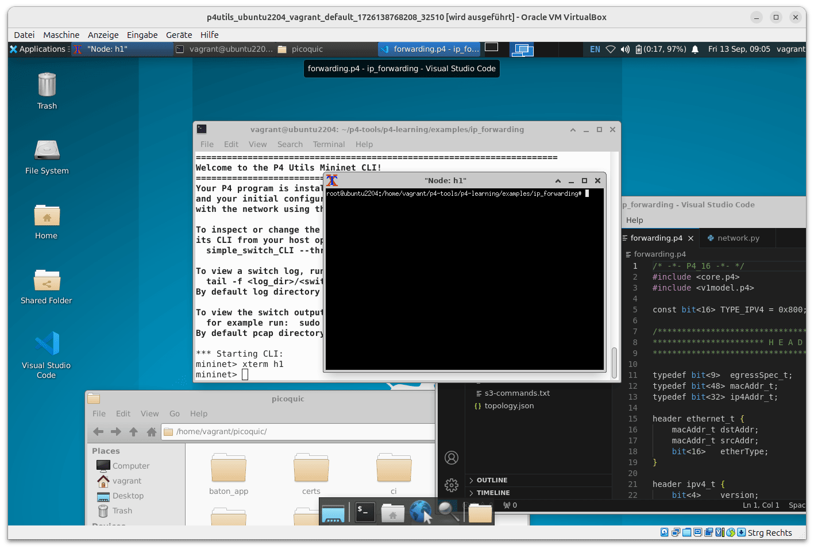

# P4-Utils Workstation Vagrant VM

Ubuntu 22.04 VM with the Xfce4 Desktop Environment and ETH-Zürich's [p4-utils](https://github.com/nsg-ethz/p4-utils). Using the VirtualBox provider.

## Included Tools

- p4-utils (Mininet, BMV2, P4C)
- [PicoQUIC](https://github.com/private-octopus/picoquic) and PicoTLS 
- Visual Studio Code + Extensions (IntelliCode, Python, C++, P4)

## Usage

1. Install Vagrant: https://developer.hashicorp.com/vagrant/install
2. Install VirtualBox: https://www.virtualbox.org/wiki/Downloads
3. Run `vagrant up`. This will take a while, be patient. You may need to start VirtualBox before running the command to prevent permission errors.

## Shared Folder

The `shared` folder is mounted inside the VM at `/shared`.

## Environmental Variables

Variable        | Default value
----------------|---------------------------------
PICOTLS_DIR     | `/home/vagrant/picotls`
PICOQUIC_DIR    | `/home/vagrant/picoquic`
